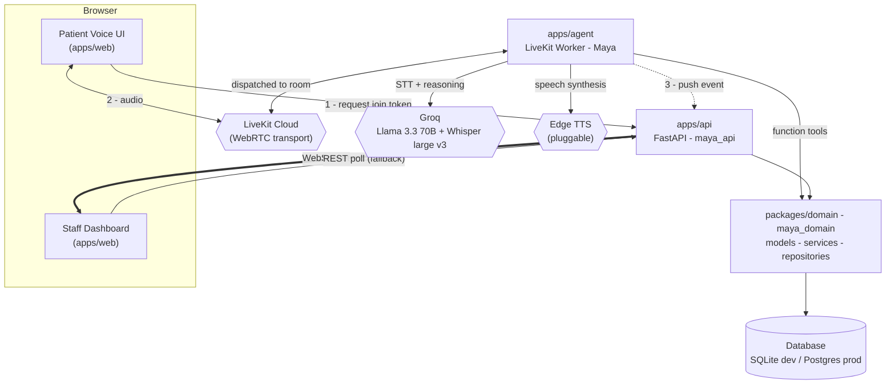
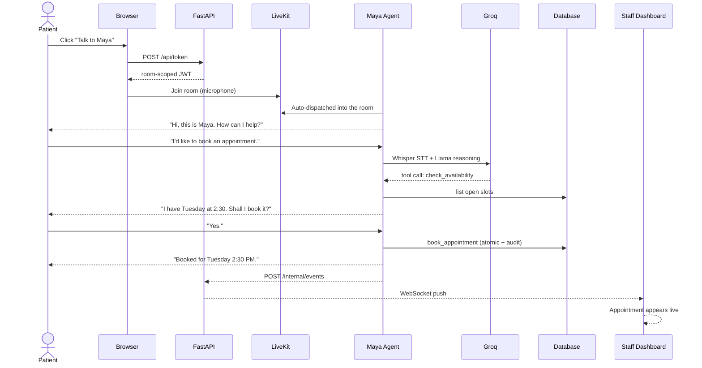

<div align="center">

# MayaDesk

### An ultra-low-latency AI healthcare voice receptionist, with a real-time staff dashboard.

Maya answers inbound browser calls over real-time voice, safely triages callers, books appointments,
escalates emergencies to humans, and streams every action to a live staff dashboard as it happens.


</div>

---

> [!IMPORTANT]
> **HIPAA-aware, NOT HIPAA-compliant.** MayaDesk is *designed* with PHI handling in mind, but it is
> **not** compliant and must never run against real patient data. The free-tier providers in the default
> stack (LiveKit, Groq, Edge TTS, Vercel, Render) do not offer Business Associate Agreements. Use
> **synthetic data only**. Real compliance requires signed BAAs across the entire data path, infrastructure
> hardening, and a formal review — none of which this repository ships.

---

## Table of contents

- [What it does](#what-it-does)
- [Architecture](#architecture)
- [How a call works](#how-a-call-works)
- [Tech stack](#tech-stack)
- [Repository layout](#repository-layout)
- [Getting started](#getting-started)
- [Configuration](#configuration)
- [API reference](#api-reference)
- [How the voice agent works](#how-the-voice-agent-works)
- [Real-time dashboard updates](#real-time-dashboard-updates)
- [Testing](#testing)
- [Production notes and scaling](#production-notes-and-scaling)
- [Roadmap](#roadmap)
- [License](#license)

---

## What it does

- **Browser voice calls.** Patients click one button and talk to Maya in natural, sub-second-latency
  speech — no phone number, no app install. Powered by LiveKit WebRTC transport.
- **Safe triage, never diagnosis.** Maya is constrained to two-sentence replies and is hard-blocked from
  diagnosing, prescribing, or interpreting symptoms. Emergencies (chest pain, severe bleeding, stroke,
  suicidal ideation, loss of consciousness, difficulty breathing) trigger immediate escalation.
- **Real backend tool calling.** Maya's LLM invokes typed function tools that execute genuine database
  transactions — checking availability, booking appointments atomically, and flagging human callbacks.
  No mocked tools.
- **Live staff dashboard.** Appointments, the callback queue, and an emergency banner update in real time.
  Actions taken by the voice agent appear on staff screens within moments.
- **One schema, two runtimes.** The API and the voice agent share a single importable domain package, so
  business rules and the data model live in exactly one place.

## Architecture

MayaDesk is a monorepo with **two Python runtimes and one Next.js frontend**, all sharing a common domain
package. The API and the agent are separate processes so the latency-critical voice loop never contends
with the request/response API, yet both mutate the same source of truth.



**Why this shape**

- **Two runtimes, one domain.** The voice loop lives in `apps/agent`, out of the API's request path, but
  its tools call the same `maya_domain` services the API uses — guaranteeing the agent performs real,
  consistent writes.
- **Interfaces at every volatile boundary.** The TTS provider, the event bus, and the database engine each
  sit behind a seam, so free-tier choices are swappable without touching call sites.
- **Atomic use cases.** A booking creates the appointment, marks the slot, and writes an audit record
  inside a single unit of work — all-or-nothing, with SAVEPOINT-isolated conflict handling for races.

## How a call works



Emergency path: if Maya detects a life-threatening situation, she interrupts the flow, advises the caller
to contact emergency services, calls `flag_for_human_callback` with `emergency` priority, and the
dashboard's emergency banner lights up in real time.

## Tech stack

| Layer | Technology |
|---|---|
| Frontend | Next.js 15 (App Router), TypeScript (strict), TailwindCSS, Zustand, TanStack React Query |
| Voice client | LiveKit Components (`@livekit/components-react`, `livekit-client`) |
| API backend | FastAPI (`maya_api`), Uvicorn, slowapi (rate limiting) |
| Voice agent | LiveKit Agents 1.6 (`AgentSession`), Silero VAD |
| Speech + reasoning | Groq — `llama-3.3-70b-versatile` (LLM), `whisper-large-v3` (STT) |
| Text-to-speech | Edge TTS via a custom `tts.TTS` adapter (swappable for Cartesia / Deepgram) |
| Domain / ORM | SQLAlchemy 2.0 async, Pydantic v2, shared `maya_domain` package |
| Migrations | Alembic (config in `packages/domain`) |
| Database | SQLite (`aiosqlite`) for dev, PostgreSQL (`asyncpg`) for prod — one env var swap |
| Runtime | Python 3.11+, Node.js 18+ |

## Repository layout

```text
MayaDesk/
├── packages/
│   └── domain/                      # maya_domain — shared by the API and the agent
│       └── maya_domain/
│           ├── config/              # typed pydantic settings
│           ├── core/                # logging, errors, request-id context, timing
│           ├── database/            # async engine, session, unit_of_work
│           ├── models/              # 7 SQLAlchemy models + enums
│           ├── schemas/             # Pydantic DTOs + dashboard projections
│           ├── repositories/        # generic + per-aggregate data access
│           ├── services/            # use cases: booking, callback, availability, dashboard
│           └── seed.py              # idempotent sample-data seeder
├── apps/
│   ├── api/                         # maya_api — FastAPI (health, token, dashboard, events, ws)
│   ├── agent/                       # maya_agent — LiveKit worker, tools, custom Edge TTS
│   └── web/                         # Next.js — patient voice UI + staff dashboard
├── .env.example                     # environment template (copy to .env)
├── Makefile                         # developer workflow targets
├── docker-compose.yml               # local services (api, web, optional postgres)
└── README.md
```

## Getting started

### Prerequisites

- Python 3.11+ and Node.js 18+
- Accounts (for a live call): a [LiveKit Cloud](https://livekit.io) project and a [Groq](https://groq.com) API key.
  The dashboard, database, tests, and seed data all run **without any credentials**.

### Setup

```bash
# 1. Clone
git clone https://github.com/khopade-works/MayaDesk.git
cd MayaDesk

# 2. Configure environment
cp .env.example .env        # fill in LiveKit + Groq keys for live voice; defaults work otherwise

# 3. Install Python packages (editable) and web dependencies
make install

# 4. Create the schema and load sample data
make migrate
make seed

# 5. Run the pieces you need (separate terminals)
make dev-api                # FastAPI      -> http://localhost:8000
make dev-web                # Next.js      -> http://localhost:3000  (dashboard at /dashboard)
make dev-agent              # Maya worker  (requires LiveKit + Groq credentials)
```

Run `make help` to list every target. Without credentials you can still explore the **staff dashboard**
at `http://localhost:3000/dashboard` — it renders the seeded appointments, callback queue, and emergency
banner against the real API.

<details>
<summary><b>All Makefile targets</b></summary>

| Target | Description |
|---|---|
| `make install` | Install Python packages (editable) and web dependencies |
| `make migrate` | Apply Alembic migrations to `DATABASE_URL` |
| `make revision m="..."` | Autogenerate a new Alembic migration |
| `make seed` | Load providers, availability, patients, appointments, callbacks |
| `make dev-api` | FastAPI with auto-reload on `:8000` |
| `make dev-web` | Next.js dev server on `:3000` |
| `make dev-agent` | Run the Maya LiveKit worker |
| `make test` | Run Python and web test suites |
| `make lint` / `make format` | Ruff + ESLint |
| `make clean` | Remove caches, build artifacts, and local databases |

</details>

## Configuration

All configuration flows through environment variables (see `.env.example`). Sensible defaults mean only
LiveKit and Groq credentials are required, and only for live voice.

| Variable | Purpose | Default |
|---|---|---|
| `DATABASE_URL` | Async SQLAlchemy URL. Swap for `postgresql+asyncpg://...` in prod | `sqlite+aiosqlite:///./maya.db` |
| `LIVEKIT_URL` / `LIVEKIT_API_KEY` / `LIVEKIT_API_SECRET` | LiveKit Cloud project (token minting + agent) | — |
| `GROQ_API_KEY` | Groq inference key | — |
| `GROQ_LLM_MODEL` / `GROQ_STT_MODEL` | Model ids | `llama-3.3-70b-versatile` / `whisper-large-v3` |
| `CORS_ORIGINS` | Comma-separated allowed origins | `http://localhost:3000` |
| `NEXT_PUBLIC_API_URL` / `NEXT_PUBLIC_LIVEKIT_URL` | Browser-exposed endpoints | `http://localhost:8000` / — |
| `RATE_LIMIT_DEFAULT` / `RATE_LIMIT_TOKEN` | slowapi limits (global / token endpoint) | `120/minute` / `10/minute` |
| `INTERNAL_EVENT_TOKEN` | Shared secret for the agent-to-API event push | unset (dev) |
| `MAYA_VOICE_*` | Voice pipeline tuning (endpointing, interruption, retries) | see `.env.example` |

**SQLite by default, Postgres by one line.** Because `packages/domain` talks to the database only through
SQLAlchemy's async engine, moving to Postgres is a single `DATABASE_URL` change plus `make migrate` — no
application code changes. A commented-out `postgres` service is included in `docker-compose.yml`.

## API reference

| Method | Path | Description |
|---|---|---|
| `GET` | `/health` | Liveness plus a live database connectivity check (503 if the DB is down) |
| `POST` | `/api/token` | Mint a room-scoped LiveKit join token for a browser caller |
| `GET` | `/api/dashboard/stats` | Headline counts (appointments, upcoming, callbacks, emergencies) |
| `GET` | `/api/dashboard/appointments` | Appointments with `status` filter and patient `search` |
| `GET` | `/api/dashboard/callbacks` | Callback queue, priority-ordered (emergencies first) |
| `GET` | `/api/dashboard/emergencies` | Pending emergency callbacks for the alert banner |
| `POST` | `/internal/events` | Internal event ingress from the agent (shared-secret guarded) |
| `WS` | `/ws/dashboard` | Realtime event stream consumed by the dashboard |

Every request carries an `X-Request-ID`, is timed, and is logged as structured JSON. Errors return a
typed JSON body; unexpected failures return a generic non-leaking 500.

## How the voice agent works

`apps/agent` runs a LiveKit Agents worker built on the current `AgentSession` API:

- **Silero VAD** is loaded once per worker process (prewarm) to keep model load off the hot path.
- **Groq Whisper** transcribes and **Groq Llama** reasons, both with API keys injected explicitly for
  testability rather than read from ambient environment.
- **Edge TTS** is wrapped in a custom `tts.TTS` subclass that streams MP3 into the framework's audio
  emitter. Because the framework treats `tts.TTS` as the interface, swapping to a streaming production
  voice (Cartesia, Deepgram Aura) is a one-line change in the session factory.
- **Turn handling, interruption (barge-in), preemptive generation, and per-provider retries** are tuned
  through an env-driven `VoiceConfig` and applied via the current `turn_handling` API.
- **Function tools** (`check_availability`, `book_appointment`, `flag_for_human_callback`) run their
  database work inside a cancellation guard, so a slow query can never freeze a live call, and return
  errors as data so Maya can gracefully offer alternatives.

## Real-time dashboard updates

The agent and API are separate processes, so the agent pushes events over HTTP:

1. After a committed booking or callback, the agent fires a best-effort `POST /internal/events` (guarded by
   `INTERNAL_EVENT_TOKEN` in production). If the API is unreachable, the event is simply dropped — the
   dashboard's polling still reflects the database change.
2. The API republishes the event on an in-process `EventBus`.
3. `/ws/dashboard` fans it out to every connected dashboard, which invalidates its React Query cache and
   refetches instantly. Polling remains the always-correct fallback.

For multi-instance deployments, the in-process bus is swapped for Redis pub/sub behind the same seam.

## Testing

```bash
# Domain suite: models, repositories, services, and regression tests
pytest packages/domain/tests -q          # 27 tests

# Frontend: type-check, lint, and production build
cd apps/web && npm run typecheck && npm run lint && npm run build
```

The domain suite covers CRUD round-trips, unique-constraint and one-appointment-per-slot enforcement,
availability filtering, callback priority ordering, cascade deletes, and regressions for two hardened
edge cases (transaction-safe booking conflicts and escaped search wildcards).

## Production notes and scaling

- **Database:** SQLite for local dev; promote to managed Postgres for anything real (free-tier ephemeral
  disks lose SQLite data on restart). One env var, no code change.
- **TTS:** Edge TTS is an unofficial, no-SLA endpoint suitable for demos only. Swap the `build_tts` factory
  for a streaming provider in production.
- **Realtime:** in-process event bus today; Redis pub/sub for horizontal scale.
- **Agents:** LiveKit workers scale horizontally per room; the API stays stateless behind them.
- **Observability:** structured logging with request/call IDs is wired from the first request.

## Roadmap

- [x] **Phase 1 — Architecture:** monorepo, shared domain package, DX tooling
- [x] **Phase 2 — Database layer:** models, migration, schemas, repositories, tests
- [x] **Phase 3 — Voice agent:** LiveKit pipeline, custom Edge TTS, token minting
- [x] **Phase 4 — Tool calling:** unit-of-work service layer and Maya's function tools
- [x] **Phase 5 — Pipeline optimization:** latency, interruption, retries, cancellation
- [x] **Phase 6 — Frontend:** patient voice UI and live staff dashboard
- [x] **Hardening:** rate limiting, security headers, safe error handling
- [x] **Realtime:** WebSocket dashboard updates with cross-process event push
- [x] **Seed data:** idempotent sample-data seeder
- [ ] **Performance & load testing:** latency budgets, failure-recovery drills
- [ ] **Deployment:** Vercel (web) and Render (API/agent), Postgres cutover, CI/CD

## License

Proprietary. Provided for demonstration and educational purposes. Not for use with real Protected Health
Information. See the safety notice above.
